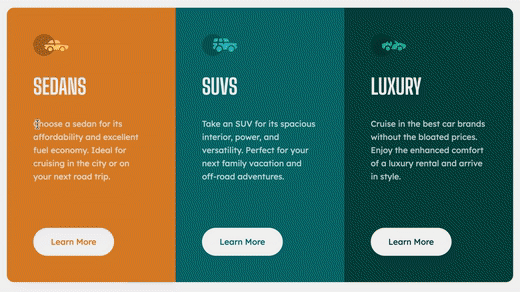
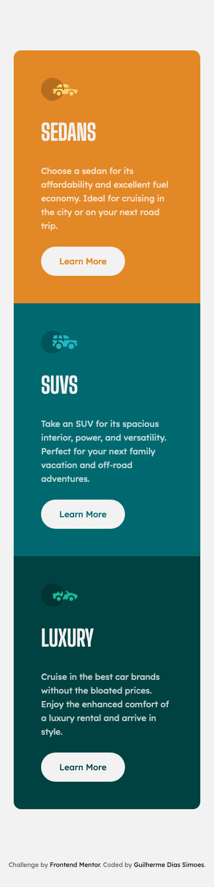

# Frontend Mentor - 3-column preview card component solution

This is a solution to the [3-column preview card component challenge on Frontend Mentor](https://www.frontendmentor.io/challenges/3column-preview-card-component-pH92eAR2-). Frontend Mentor challenges help you improve your coding skills by building realistic projects.

## Table of contents

-   [Overview](#overview)
    -   [The challenge](#the-challenge)
    -   [Screenshots](#screenshots)
    -   [Links](#links)
-   [My process](#my-process)
    -   [Built with](#built-with)
    -   [What I learned](#what-i-learned)
    -   [Continued development](#continued-development)
    -   [Useful resources](#useful-resources)
-   [Author](#author)

## Overview

### The challenge

Users should be able to:

-   View the optimal layout depending on their device's screen size
-   See hover states for interactive elements

### Screenshots

-   Desktop

-   Mobile

### Links

-   Solution URL: <https://github.com/gdsimoes/3-column-preview-card-component>
-   Live Site URL: <https://gdsimoes.github.io/3-column-preview-card-component>

## My process

### Built with

-   Semantic HTML5 markup
-   CSS custom properties
-   Flexbox
-   Mobile-first workflow

### What I learned

This Frontend Mentor challenge was the simplest one yet, but there is the opportunity to learn even in the simplest tasks. I improved my skills in choosing the correct size units to create a truly responsive website, learned how to make beautiful buttons that work consistently across browsers, and used the transparent keyword as a value for the first time.

### Continued development

I would love to learn how to create enticing animations for buttons, and I plan to spend some time doing that in my next project.

### Useful resources

-   [Overriding Default Button Styles | CSS-Tricks](https://css-tricks.com/overriding-default-button-styles/) - Once again, CSS-Tricks came to the rescue. This article had a fascinating discussion about buttons and how to create a consistent design.

## Author

-   Website - <https://gdsimoes.com>
-   Frontend Mentor - [@gdsimoes](https://www.frontendmentor.io/profile/gdsimoes)
-   LinkedIn - [Guilherme Dias Simoes](https://www.linkedin.com/in/gdsimoes)
